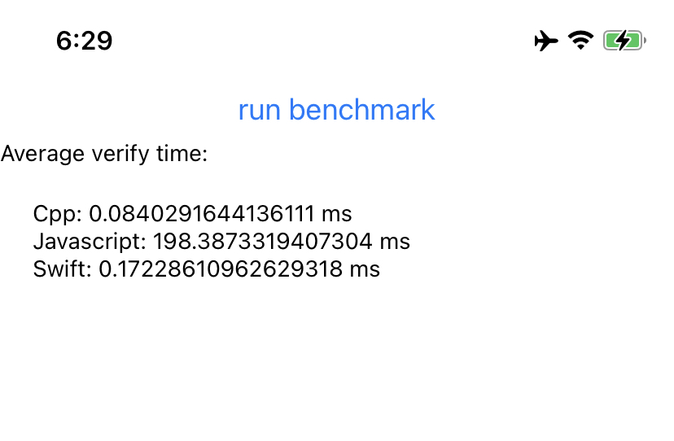

# react-native-cryptography-benchmarks
Purpose is to benchmark crypto operations in different runtimes(JS, CPP, Swift) available to react native. Gives a bit of guidance for react native developers when looking to improve crypto operations in their apps.

### iOS supported only ATM

This benchmark will run ECDSA verification in three different environments from react native:
 1. Pure JS using [elliptic](https://www.npmjs.com/package/elliptic) library
 2. CPP([wolfssl](https://www.wolfssl.com)) via react native JSI
 3. Swift([Swift Crypto](https://github.com/apple/swift-crypto)) via react native JSI
 
Steps: get the app running like a usual react native app
```sh
yarn install
cd ios && pod install && cd ..
yarn ios
```
Edit `App.tsx` to update iterations and message size(defaults to 30, message size is 4096 bytes)
Example benchmark on iPhone 11, ECDSA P-256 verification, message size 4096 bytes and 30 iterations
 * Cpp is over 2361 times faster than using pure JS
 * Swift is over 1153 times faster than using pure JS
 * Cpp is over 2 times faster than using swift


Average duration of verification in milliseconds

| iterations, message size | Javascript  | Swift       | Cpp         |
| ------------------------ | ----------- | ----------- | ----------- |
| 1, 256                   | 199.098     | 0.241       | 0.128       |
| 1, 4096                  | 201.070     | 0.249       | 0.113       |
| 30, 4096                 | 198.387     | 0.172       | 0.084       |

TODOs: 
 * Explain how to link wolfssl lib and headers to xcode project. Describe how to enable hardware acceleration for wolfssl
 * A benchmark of batch verification would be interesting(would improve memory transfers between JS and native world)
 * Could add SHA256 benchmarks too
 * Add comparison of v8 vs JSC vs Hermes JS engine, differences are really only felt on android